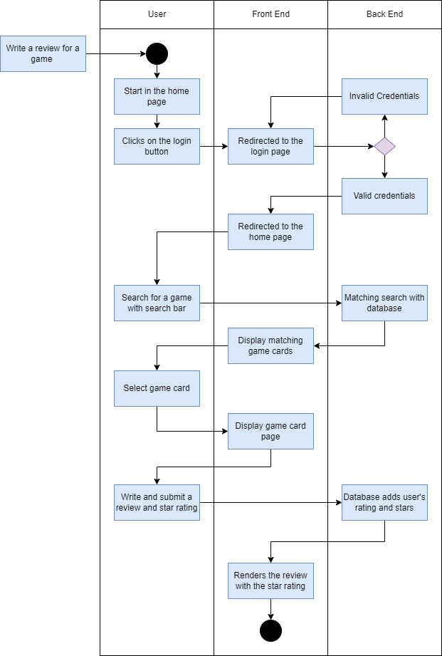
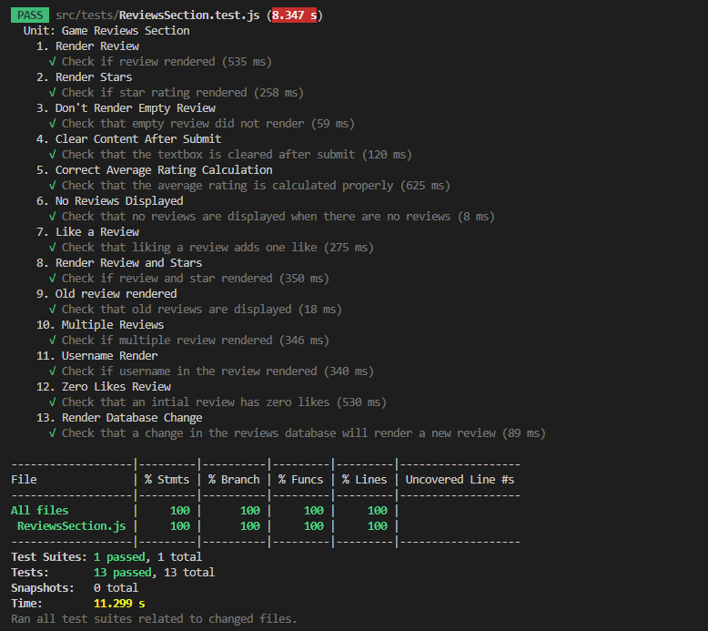

# INFO 443 Project 1 Report
By Lauren Wong and Sachi Figliolini

INFO 443 Spring 2023

## Code Structure Analysis

### 1. Code-level Artchitectural Elements

#### List of Architectural Elements:
The following list contains all the architectural elements included in the React app for My Game List broken down into their JavaScript module, which corresponds to the section of the website they are a part of (e.g. navigation bar, selected game page, etc.). It also includes brief descriptions of the element’s  purpose and relationship to the other elements in the system.

***Note:** The elements highlighted in bold are React components and the names not in bold are the JavaScript module they are in. We organized it this way to better organize the components according to the part of the website they represent.

- NavBar
  - **NavBar** – creates the navigation bar used throughout the website
  - **SearchNav** – creates the search bar section of the navigation bar that is responsible for handling searches for users or games using keywords
  - **DefaultNav** – creates the regular navigation bar intended for larger screens like laptops
  - **CollapsedNav** – creates the collapsed navigation bar for smaller screens like phones (changes into a hamburger menu containing all the same buttons as the DefaultNav)
- Login
  - **LoginPage** – creates the login page for the website
  - **Login** – creates the login section of the login page where users can input their username and password to access their account
  - **Intro** – creates a short introduction to the website on the login page
- About
  - **IntroSection** – creates a short introduction to the website for new users
  - **InfoCards** – creates a section for all the cards containing information about the website’s features for users to learn about
  - **InfoCard** – creates a single card on the page containing information on one of the website’s features
- SignUp
  - **SignUpPage** – creates the signup page for the website
  - **SignUp** – creates the sign up section of the page where users can create a new account
- Results
  - **Results** – creates a page displaying the search results from searching for either users or games
  - **UserCards** – creates a page for the user search results containing a card for each user found
  - **UserCard** – creates a single card to be used in the user search results, where each card contains information on a user of the website (includes name, image, and the games they have saved)
  - **GameCards** – creates a page for the game search results containing a card for each game found
  - **Genre** – creates the filters for game genre on the search page
  - **Pages** – creates the basic page layout for search results page that is used for the UserCards and GameCards components
- GameList (it is essentially the homepage of the website)
  - **GameCards** – creates a section containing the game cards for all the games listed in the data provided to it (used to create the game cards in the GameList and Results modules)
  - **GameCard** – creates a single game card that contains an image of the game and can be clicked to open up the SelectedGamePage where users can get more information on the specific game
  - **MyGames** – creates the section of the home page containing all the games that the user has saved
  - **Suggestions** – creates the section of the home page containing various game suggestions for the user to play next
  - **StatBox** – creates the section of the home page displaying basic statistics on which games the user is planning on playing, is currently playing, and has stopped playing
- Selected
  - **SelectedGamePage** – creates the page for a single game containing additional information on the game and reviews from other users
  - **GameInfo** – creates the section of the selected game page containing additional information on the game (e.g. description, genres, etc.)
- ReviewsSection
  - **ReviewsSection** – creates the section of the selected game page containing the reviews of the game from other users and a section where the user can write their own review
  - **ReviewForm** – creates the section where users can submit a review and rate the game
  - **FormReviewStars** – creates the buttons that users use to rate the game in the form
  - **GameReviewsSection** – creates a section for information on game reviews including all the reviews of the game and the average rating for the game
  - **GameReviews** – creates a section for all the individual game review cards to be displayed
  - **Review** – creates a single card containing information on a review (e.g. user who wrote the review, review, rating, etc.)
  - **ReactionsSection** – creates the like button section of a review card
  - **ReviewHeader** – creates the header of a review card that includes information on the username, user profile image, rating, and time posted
  - **ReviewCardStars** – creates the review stars for a specific review card
- Tags
  - **Tags** – creates the tag buttons in the selected game page for users tag a game as playing, completed, planned, or stopped so they can keep track of their games in the future
- Footer
  - **Footer** – creates a basic footer for the website

#### UML Component Diagram:

Figure 1 is a UML component diagram showing the relationships between the different architectural elements in the React app for My Game List. The elements have been grouped together according to their JavaScript module and purpose to help with understanding the overall structure of the app. The arrows represent the relationships between nested components (child → parent) and may include additional information on the cardinality if it is different from the standard 1 to 1 relationship.

<figcaption>
Figure 1: Architectural Element Component Diagram for MGL.
</figcaption>
This diagram is visualizing the relationships between all architectural elements, their nested elements, and JavaScript modules in the My Game List React app.

### 2. Code Flows

#### Process Flow:
The following list contains a high-level “tracing” of the “My Game List” React web app. The list is in functional order, listing when the steps occur in a linear sequence of input to output. Each statement contains what the user would input or click on in a front end perspective describing what renders or state-change flow and the subpoints contain a description of the code involved with that step from a code perspective.

- When first opening the system, the user clicks on the “Login” button, which causes the app to redirect to the login page.The user then can either login or click the button to create a new account.
    - App.js redirects to the LoginPage in Login.js.
- When logging in, the user must type in their email address and password in a form or click to login with their Google account, which will display a popup with further instructions. 
    - The system authorizes the credentials the user inputs through firebase and redirects back to the App.js home page.
    - The function validates the user credentials and the function signInWithGoogle both redirects to the pop up and authorizes Google authentication.
- If they do not have an account, the user clicks on the “Create Account” button to make a new account.
    - Firebase stores the new credentials to the database.
    - LoginPage redirects to SignUp in SignUp.js.
- After logging in or creating an account the user is redirected back to the homepage.
    - Both LoginPage and Signup redirects to App.js.
- The user types a game into the search bar and presses enter, redirecting to the search results.
    - The NavBar in App.js redirects to the NavBar.js for rendering a search bar and taking in what the user inputs.
        - SearchNav function allows users to search for a specific user or game. 
    - Redirected to Results.js to render all the games that match with the search for the user to see.
- Click on one of the game cards of choice and scroll down to write a review.
    - Redirected to Selected.js where the user can see all the game cards and select/click on one of the cards.
    - This redirects to Results.js, which shows the information for one of the games. 
    - When the user scrolls ReviewsSection.js renders, which takes in what the user will input as a review.
- They click on a specific number of stars they enjoyed the game at and write a review and click on the button “submit”.
    - ReviewsSection.js will store the review onto firebase and render the site to show the review.

#### UML Activity Diagram:

Figure 2 is a UML activity diagram, which shows the relationships and dependencies between the different architectural components in the React app for My Game List when a user wants to login and write a review for a game. The arrows represent the various relationship flows within the app that allow the user complete their task, the dark circles represent the start and end of the flow, and the purple diamonds represent the split in decision.

<figcaption>
Figure 2: Architectural Element Activity Diagram for MGL.
</figcaption>
This diagram visualizes the relationships between components in the My Game List React app when logging in and writing a review. 

## Architecture Assessment + Refactoring Solutions

### Code Smells

- Long Function
  - Location: `ReviewsSection()`
    - Description: Function is too long and contains too many helper functions or additional code that that is not necessary in the function, which makes it hard to understand and make modifications.
    - Fix: Refactored code to calculate the average rating for game reviews into a separate helper function.
    - Location: `Review()`
    - Description: Same as ReviewsSection(). Function is too long, which makes it hard to understand and maintain.
- Bloated Components
  - Idea from: [https://hackernoon.com](https://hackernoon.com/lessons-learned-common-react-code-smells-and-how-to-avoid-them-f253eb9696a4)
  - Location: `ReviewsSection()`
    - Description: The variable gameReviewsToDisplay used to create the ReviewsSection component makes the component overly long and complicated even though it can be divided up into smaller components to make it simpler.
    - Fix: Created a new child component called GameReviewsSection for the section to display all the reviews on the game and the average rating.
  - Location: `Review()`
    - Description: The component for a review card is overly complex and can be broken down into different sections to make it easier to understand.
    - Fix: Moved the code to create the (non-interactive) review stars on a single review card into its own component called ReviewCardStars and created another component for the ReviewHeader to simplify the Review component.
- Mysterious Name
  - Location: `ReviewsSection()`
    - Description: The function finalCleanup in the useEffect does not clearly communicate what it does and how it is used.
    - Fix: Renamed the function to setReviewsHistoryOnChange() to more clearly communicate its purpose.
  - Location: `ReviewBox()`
    - Description: The name for the ReviewBox function does not clearly communicate that it is a form that handles submitting a review and/or rating.
    - Fix: Renamed the ReviewBox component to ReviewForm.
  - Location: `ReviewStars()`
    - Description: The name for the ReviewStars function does not communicate that it creates the buttons for adding a rating in the form and can be confused with other review stars on the page.
    - Fix: Renamed the ReviewStars component to FormReviewStars to prevent confusion with the review stars on each review card.
  - Location: `Review()`
    - Description: The variable reviewStars has the same as the ReviewStars component even though the variable represents a fixed rating for a review on a card, not the ReviewStar buttons used in the form.
    - Fix: Created a new component called ReviewCardStars to differentiate it from the FormReviewStars.

### Documentation/Readability Concerns

Overall, the code is documented well and readable when documenting the control flow of ReviewSection.js. However, the following are areas that could improve the documentation of the code and potential places where there might be a readability concern:

- Long Functions
    - Location: ReviewsSection()
    - The ReviewsSection() component is very long and could potentially be broken down into smaller functions to improve readability.
- Comments
    - There are no comments in the file, which could help make it easier to understand the implementation of firebase.
- Code Repetition
    - Location: GameReviewSection() and ReviewsSection()
    - There is code repetition in functions GameReviewSection() and ReviewsSection() in regards to checking if reviews are displayed.

### Standards Violations

- Web Accessibility standards
  - followed the guidelines from:
    - [https://accessibility.18f.gov](https://accessibility.18f.gov/checklist/)
    - [https://www.w3.org](https://www.w3.org/WAI/WCAG21/quickref/)
  - Violations:
    - Incorrect use of the button element for the star rating on review cards even though they are a non-interactive element. So when you try to navigate the ReactionsSection using the tab on the keyboard it focuses on that element even though it is non-interactive, which causes confusion on whether users can actually interact with the element or not.
      - Fix: Changed the button element to a span element to ensure that it is not counted as an interactive element on the page so that it is keyboard accessible.
    - Lack of proper accessible names and/or descriptions for interactive elements (e.g. the review star buttons in the form and the like buttons on review cards) to help users using screen readers determine the purpose or function/action of the element.
      - Fix: Added an aria-label for the review star buttons in the form and the like buttons on the review cards.

### Design Quality Deficiencies

- Modifiability
    - Could break down functions into smaller functions of components. The getAverageRating() function could be made into a separate utility function.
- Performance (Efficiency)
    - In reviewsHistory() causes re-renders when it is updated.
- Security
    - submitReview() uses the push function to add new reviews to the firebase, which could allow any user to inject malicious code into the database.

## Automated Tests

All tests are included in the folder titled “test” in the “src” folder of the repository.

To run the tests first navigate to the “project-1-lwong121” repository and install:
- `Npm install`
- `Npm install -g firebase-tools`
- `Npm install react-scripts`
- `Npm install jest-dom`
- `npm install --save-dev @testing-library/jest-dom`
- `npm install --save-dev @testing-library/react`
- `npm install --save-dev @testing-library/user-event`
- `npm install firebase`
- `npm install @fortawesome/react-fontawesome`
- `npm install @fortawesome/free-solid-svg-icons`

After installing, run `npm test` to run all the test and `npm test -- --coverage` to run the tests and get a coverage report for ReviewsSection.js.

Because users need to be signed in to have access to view and write the comments, we have made the test user already logged in

### What aspects of the code were tested and why?

1. Render Review - Check if review rendered
    - We wanted to test whether adding a review without a star rating would be successfully added to the database and rendered under the game reviews section to ensure that users have the option of just adding a review.
2. Render Stars - Check if star rating rendered
    - We wanted to test whether adding a star rating without a review would be successfully added to the database and rendered under the game reviews section to ensure that users have the option of just adding a rating.
3. Don't Render Empty Review - Check that empty review did not render
    - We wanted to make sure that users could only submit a review when there is a star rating and/or review entered in the form (not when the form is empty) so that we don’t have any empty reviews stored in our database.
4. Clear Content After Submit - Check that the textbox is cleared after submit
    - We wanted to ensure that the content in the form was properly cleared after a user clicks submit because it will act as a visual cue to the user that their review has successfully been submitted and prepare the form for any future submissions.
5. Correct Average Rating Calculation - Check that the average rating is calculated properly
    - We wanted to make sure that the average rating for a game was correctly calculated using the reviews which did actually provide a star rating and excluding those which did not to ensure that we are accurately reporting the user ratings.
6. No Reviews Displayed - Check that no reviews are displayed when there are no reviews
    - For games with no reviews yet, we wanted to ensure that the game reviews section would not show any reviews and that it would contain a message to clearly communicate to users that the game does not have a review yet.
7. Like a Review - Check that liking a review adds one like
    - We wanted to ensure that clicking the like button on a review increases the count of likes for that review by 1 and that you could like a review multiple times so that the like button will work as expected when users interact with it.
8. Render Review and Stars - Check if review and star rendered
    - We wanted to ensure that both the star rating and the written review will render together.
9. Old review rendered" - Check that old reviews are displayed
    - For reviews with past reviews, we wanted to make sure that old submitted reviews will render when opening a game profile.
10. Multiple Reviews - Check if multiple review rendered
    - We wanted to ensure that a single user can submit multiple reviews for the same game.
11. Username Render - Check if username in the review rendered
    - We wanted to ensure that the usernames would be displayed on the review.
12. Zero Likes Review - Check that an intial review has zero likes
    - We wanted to check if a new review has zero likes on it when it is initially posted.
13. Render Database Change - Check that a change in the reviews database will render a new review
    - We wanted to ensure that an update to the allReviews firebase database like adding a new review would correctly result in that new review being rendered on the page as well.

### Documentation of test coverage

Figure 3 is a screenshot taken of the code testing coverage report.

<figcaption>
Figure 3: Screenshot of the Test Coverage Report.
</figcaption>
This screenshot shows the 13 tests passing and the coverage of ReviewsSection.js. 

---

# Checkpoints

## Checkpoint 1

**Name of Project:** My Game List (MGL)

**Who Created it:** Jerome Ortiz Orille, Gavin Patrick Pereira & Lauren Wong

**What kind of software:** React App

**Description:** MGL is a simple and effective way to keep track of all your games, connect with friends, share your thoughts on games you liked or didn't like, and discover new games to play next.

**Link to website:** [https://mygamelist-a7724.web.app/]

**Link to repo:** [https://github.com/Info-433-Spring-2023/project-1-lwong121]

## Checkpoint 2

**Class Diagram**

**Activity Diagram**

**Selected Candidate Element:** Selected.js Components

## Checkpoint 3

**Instructions for how to run tests:**

npm install the following:
* -g firebase-tools
* react-scripts
* jest-dom
* --save-dev @testing-library/jest-dom
* --save-dev @testing-library/react
* --save-dev @testing-library/user-event
* firebase
* @fortawesome/react-fontawesome
* @fortawesome/free-solid-svg-icons

then run npm test and type a to run all tests

**Updated Test Coverage Report:**

---
**ISSUE RESOLVED: Can Ignore**

Note on missing code coverage:

We are aware of the missing code coverage for lines 17-25, which corresponds to the `finalCleanup()` function in the `useEffect()` under the `<ReviewsSection>` component in ReviewsSection.js. But after several attempts (as seen in the "Test finalCleanup() function" test), we have not yet managed to solve this issue.

Here are some links we tried to look at:
- https://stackoverflow.com/questions/58194024/how-to-unit-test-useeffect-cleanup-return-function-using-jest-and-enzyme
- https://jestjs.io/docs/jest-object#jestspyonobject-methodname
- https://testing-library.com/docs/react-testing-library/api/#unmount

This is a screenshot of the code we have missing code coverage on. Other than these lines, we have 100% code coverage.

*Replace this later when we have all the tests
